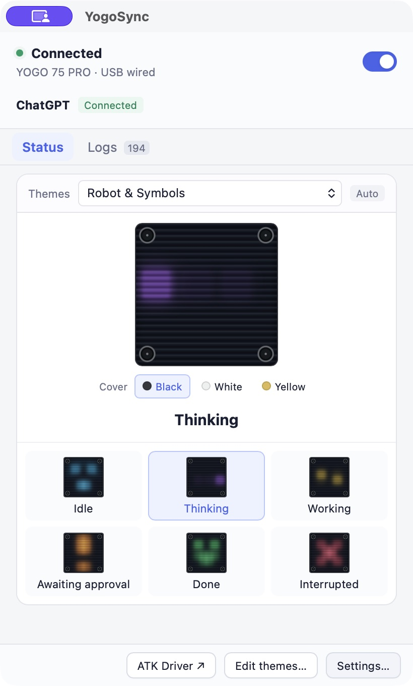

# YogoSync

[简体中文](README.zh-CN.md)

Display ChatGPT / Codex task states on the **YOGO 75 PRO's 6 × 6 RGB matrix**. Supports **macOS Apple Silicon** via **USB wired mode or the 2.4 GHz receiver**, selected automatically.

## Features

- Six task states: idle, thinking, working, awaiting approval, done, and interrupted. Approval and active work take priority across concurrent tasks.
- Custom icons, colors, and frame animations, with theme import and export.
- Black, white, and yellow cover previews, plus menu bar access.
- English and Chinese interfaces, with System default, 简体中文, and English options in Settings. Chinese variants use Simplified Chinese; other languages use English.

## Public beta · macOS installation

Download the **Apple Silicon DMG** and its `.sha256` file from [GitHub Releases](https://github.com/NemoAlex/YogoSync/releases). Requires macOS 12 or later. This beta is ad-hoc signed, without Apple Developer ID signing or notarization.

1. Open the DMG and drag **YogoSync** into **Applications**.
2. Try opening YogoSync once. If macOS blocks it because the developer cannot be verified or the app is not notarized, and you trust this download, open **System Settings → Privacy & Security → Open Anyway**, then confirm **Open**. See [Apple’s instructions](https://support.apple.com/102445).
3. Optionally verify the download in its folder with `shasum -a 256 -c YogoSync-1.1.0-macOS-arm64.dmg.sha256`.

## Getting started

Connect the keyboard in USB wired mode or plug in the receiver, then open YogoSync. Click **Configure Hooks**, then follow **Authorize** to grant access. Codex CLI users can authorize through `/hooks`.

Continue any task after authorization; the status changes to **Connected** when an event arrives. If it keeps waiting, restart the client.

## Notes

- Disconnecting or quitting restores the original lighting preset. Existing custom artwork cannot be restored; the keyboard returns to ATK preset mode 0.
- Task states stay on your computer. Conversation content is neither saved nor uploaded.
